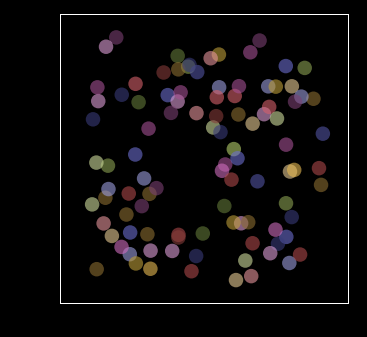

# balls in a box

We randomly place some balls in a box and move them in random directions. They bounce off the walls of the box. The result will look like this:

Or this:

If you let all the balls to start from the same point, you can see some interesting mathematical phenomena:

